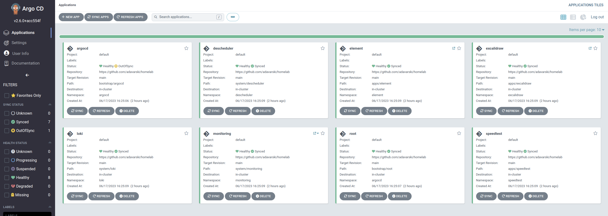
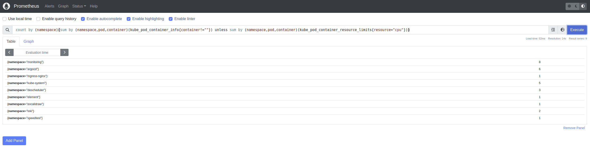
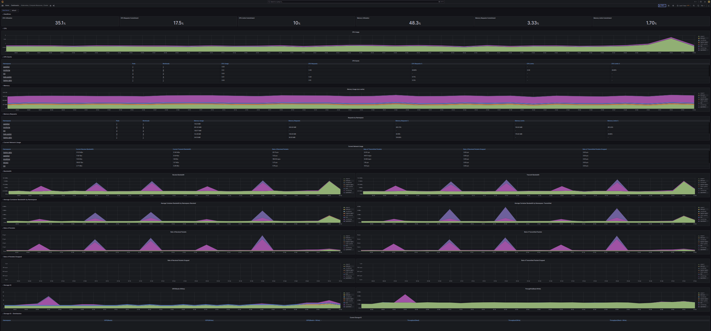
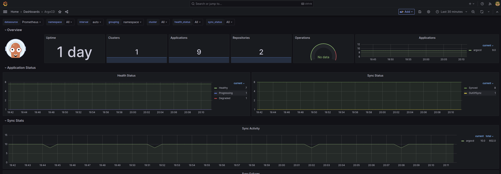

## GitOps ArgoCD-based HomeLab Development Environment

Fully automated Kubernetes and GitOps setup to host my important services at home.


Note: We can use GitHub repos (`APPS repos`) and GitHub Actions (GitOps CI) to build docker images. Once CI execution is done, the artifact will be pushed (push containers images to docker registry & setup images tags in this `INFRA repo` apps folder: helm charts or k8s manifests + kustomize) and ArgoCD will be taking care of the CD -> Ref: https://github.com/adavarski/ArgoCD-GitOps-playground && https://github.com/adavarski/k3d-GH-Actions && https://github.com/adavarski/gitops-k3d-tekton-argocd (example using Tekton to build/push docker images: Golang) && https://github.com/adavarski/gitops-k3d-tekton-argocd (example using Tekton to build/test/push docker images: Java & Maven)

Note: Renovate watches this Git repository and creates pull requests (PRs) when it finds updates to Docker images, Helm charts, and other dependencies. 

Read the [Docs](https://adavarski.github.io/homelab-argocd) for technical details.

## Development Environment

devops server IP: `192.168.1.99`

### Getting Started

Clone the repository:

```sh
$ git clone https://github.com/adavarski/homelab-argocd
```

### Dependencies

- [Docker](https://docs.docker.com/engine/install/ubuntu/)
- [Go Task](https://taskfile.dev/installation)
- [kubectl](https://kubernetes.io/docs/tasks/tools/#kubectl)
- [KiD](https://kind.sigs.k8s.io/docs/user/quick-start/)
- [ArgoCD CLI](https://argo-cd.readthedocs.io/en/stable/cli_installation/)

 Note: repo Docs -> Install [Material for MkDocs](https://squidfunk.github.io/mkdocs-material/getting-started/#latest) including [image processing dependencies](https://squidfunk.github.io/mkdocs-material/setup/dependencies/image-processing)

```
### Go Task installation (Go Task as a more modern iteration of the Makefile utility)
$ sudo sh -c "$(curl --location https://taskfile.dev/install.sh)" -- -d -b /usr/local/bin
```

### Develop

#### Bootstrap

Run the task `dev` to fully bootstrap the development environment.

```bash
$ task dev
```

After waiting ~5 minutes we should be able to reach the hosted services at `http://*.192.168.1.99.nip.io:8888`, for example at [http://argocd.192.168.1.99.nip.io:8888](https://argocd.192.168.1.99.nip.io:8888).

Warning "Caveats"

    - No persistent storage

#### Explore

Get access to secrets by using some task scripts:

```bash
$ task --list-all
task: Available tasks for this project:
* bootstrap:                           
* dev:                                 
* dev:cleanup:                         
* scripts:argocd-admin-password: 
* scripts:grafana-admin-password:
$ task scripts:argocd-admin-password
$ task scripts:grafana-admin-password
```

Ingresses:

```bash
$ kubectl get ing --all-namespaces
NAMESPACE    NAME                                    CLASS   HOSTS                            ADDRESS      PORTS   AGE
argocd       argocd-ingress                          nginx   argocd.192.168.1.99.nip.io       172.28.0.2   80      99m
monitoring   monitoring-grafana                      nginx   grafana.192.168.1.99.nip.io      172.28.0.2   80      93m
element      element-elementweb                      nginx   chat.192.168.1.99.nip.io         172.28.0.2   80      93m
excalidraw   excalidraw                              nginx   draw.192.168.1.99.nip.io         172.28.0.2   80      93m
monitoring   monitoring-kube-prometheus-prometheus   nginx   prometheus.192.168.1.99.nip.io   172.28.0.2   80      93m
```

ArgoCD CLI:

```
$ argocd version
argocd: v2.7.6+00c914a
  BuildDate: 2023-06-20T21:18:20Z
  GitCommit: 00c914a948d9e8ad99be8bd82a368fbdeba12f88
  GitTreeState: clean
  GoVersion: go1.19.10
  Compiler: gc
  Platform: linux/amd64
argocd-server: v2.6.0+acc554f
  BuildDate: 2023-02-06T21:17:26Z
  GitCommit: acc554f3d99010e0353b498a595844b30090556f
  GitTreeState: clean
  GoVersion: go1.18.10
  Compiler: gc
  Platform: linux/amd64
  Kustomize Version: v4.5.7 2022-08-02T16:35:54Z
  Helm Version: v3.10.3+g835b733
  Kubectl Version: v0.24.2
  Jsonnet Version: v0.19.1


$ argocd login --insecure argocd.192.168.1.99.nip.io --grpc-web
Username: admin
Password: 
'admin:login' logged in successfully
Context 'argocd.192.168.1.99.nip.io' updated

$ argocd app list
NAME                CLUSTER     NAMESPACE    PROJECT  STATUS     HEALTH    SYNCPOLICY  CONDITIONS  REPO                                         PATH                TARGET
argocd/argocd       in-cluster  argocd       default  OutOfSync  Healthy   Auto-Prune  <none>      https://github.com/adavarski/homelab-argocd  bootstrap/argocd    main
argocd/descheduler  in-cluster  descheduler  default  Synced     Healthy   Auto-Prune  <none>      https://github.com/adavarski/homelab-argocd  system/descheduler  main
argocd/element      in-cluster  element      default  Synced     Healthy   Auto-Prune  <none>      https://github.com/adavarski/homelab-argocd  apps/element        main
argocd/excalidraw   in-cluster  excalidraw   default  Synced     Healthy   Auto-Prune  <none>      https://github.com/adavarski/homelab-argocd  apps/excalidraw     main
argocd/loki         in-cluster  loki         default  Synced     Healthy   Auto-Prune  <none>      https://github.com/adavarski/homelab-argocd  system/loki         main
argocd/monitoring   in-cluster  monitoring   default  Synced     Healthy   Auto-Prune  <none>      https://github.com/adavarski/homelab-argocd  system/monitoring   main
argocd/root         in-cluster  argocd       default  Synced     Degraded  Auto-Prune  <none>      https://github.com/adavarski/homelab-argocd  bootstrap/root      main
argocd/speedtest    in-cluster  speedtest    default  Synced     Healthy   Auto-Prune  <none>      https://github.com/adavarski/homelab-argocd  apps/speedtest      main


```

#### Screenshots

Browser: 
- ArgoCD: http://argocd.192.168.1.99.nip.io
- Prometheus: http://prometheus.192.168.1.99.nip.io
- Grafana: http://grafana.192.168.1.99.nip.io

| ArgoCD |
| :--: |
|  |
| Prometheus |
|  |
| Grafana |
|  |

Note: We can import the example Dashboard for Argo CD. The dashboard can be found in the GitHub repository of the Argo CD project at https://github.com/argoproj/argo-cd/blob/master/examples/dashboard.json.

  

### Clean up

Run the task `dev:cleanup` to clean up (delete the local test Kubernetes cluster)

```bash
$ task dev:cleanup
```
### TODO
- Fix system:tekton-pipelines (Tekton CI)
- Add HashiCorp Vault + k8s External, based on https://github.com/adavarski/k8s-vault-secrets#demo3-eso-external-secret-operato
- Add SOPS (Secrets with Kustomize and SOPS: https://cloud.redhat.com/blog/a-guide-to-gitops-and-secret-management-with-argocd-operator-and-sops)
- helm install ingress-nginx ingress-nginx/ingress-nginx -n ingress-nginx --create-namespace --set controller.publishService.enabled=true --wait


